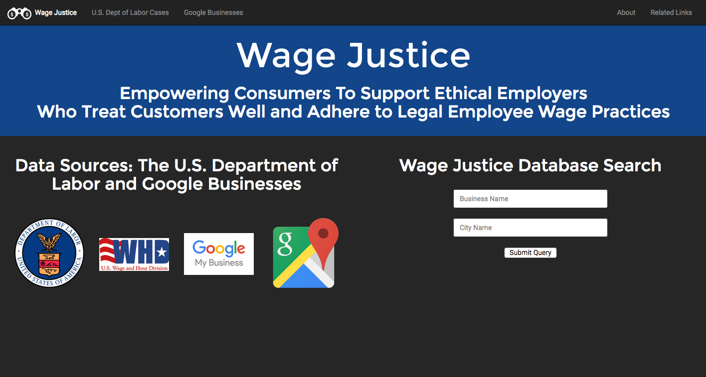
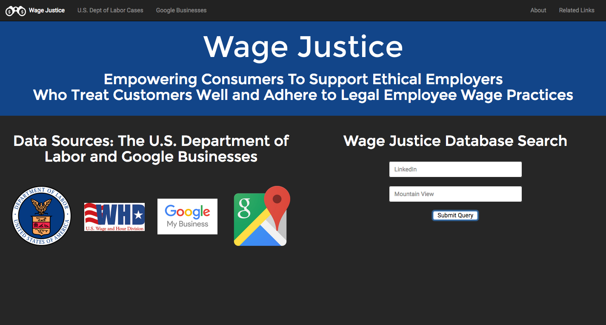
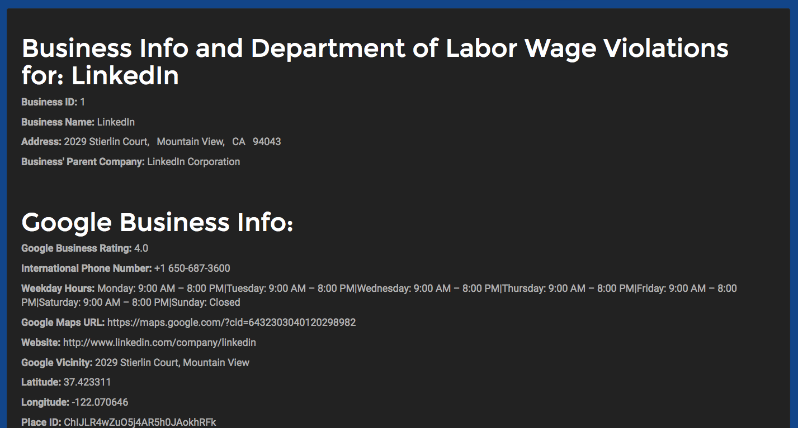
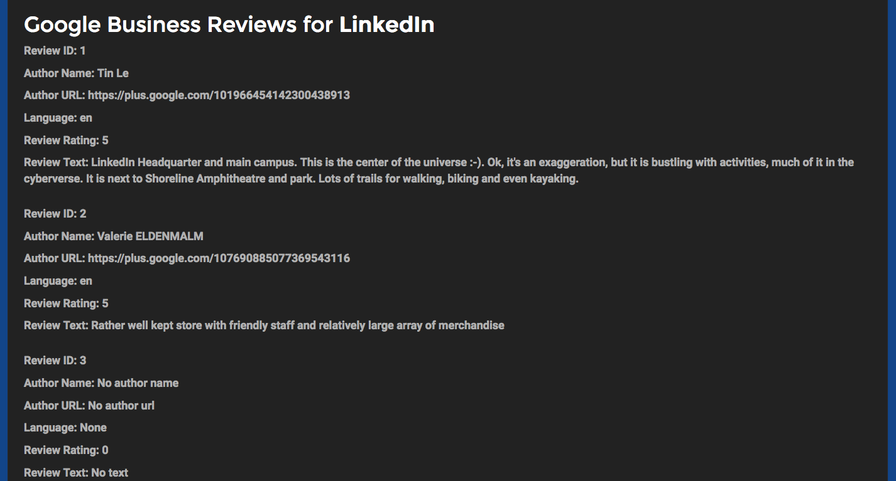
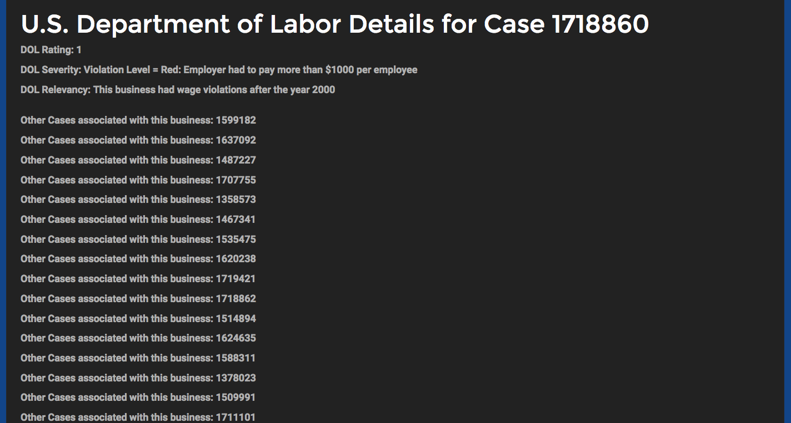
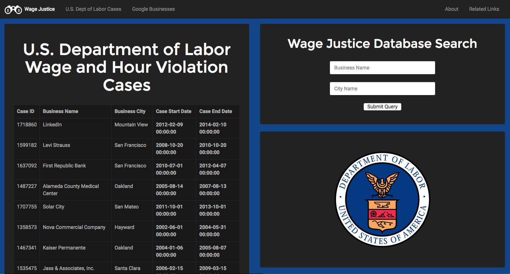
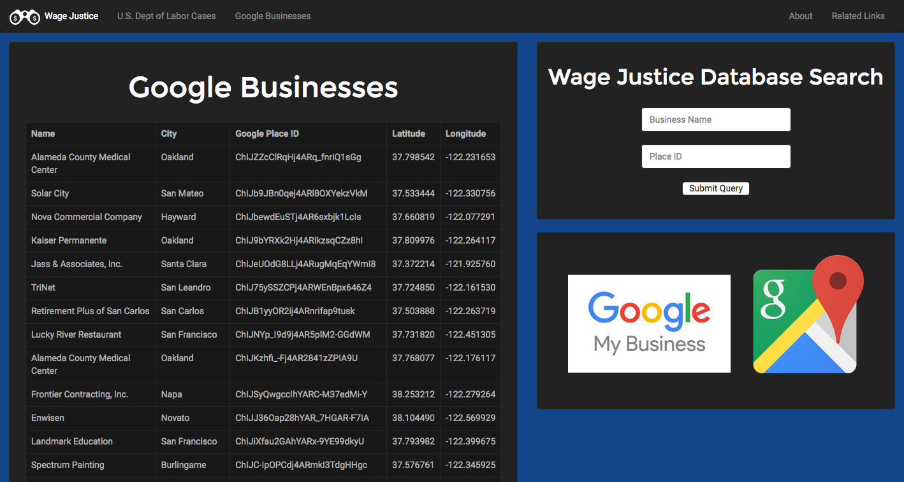
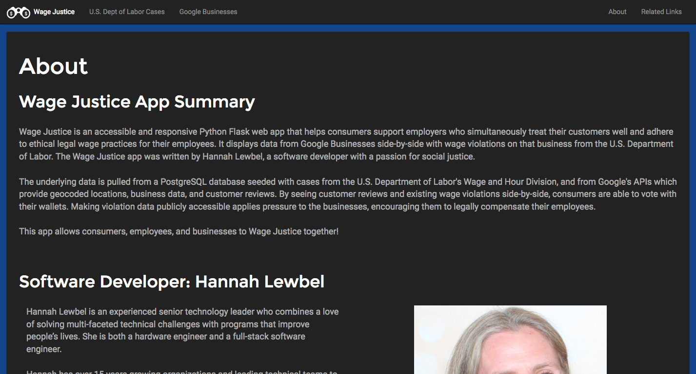
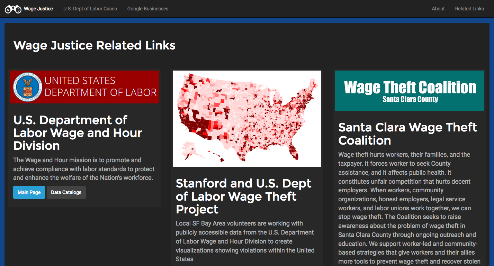

Wage Justice
--------

**Description**

Wage Justice is an accessible and responsive Python Flask web app that helps consumers support employers who simultaneously treat their customers well and adhere to ethical legal wage practices for their employees. It displays data from Google Businesses side-by-side with wage violations on that business from the U.S. Department of Labor. The Wage Justice app was written by Hannah Lewbel, a software developer with a passion for social justice.

The underlying data is pulled from a PostgreSQL database seeded with cases from the U.S. Department of Labor's Wage and Hour Division, and from Google's APIs which provide geocoded locations, business data, and customer reviews. By seeing customer reviews and existing wage violations side-by-side, consumers are able to vote with their wallets. Making violation data publicly accessible applies pressure to the businesses, encouraging them to legally compensate their employees.

This app allows consumers, employees, and businesses to Wage Justice together!    

**How Wage Justice Works**

On the homepage, the user types in both a business name and city into the search boxes which query a previously seeded PostgreSQL database of businesses that have U.S. Department of Labor Wage and Hour violation cases and which also have been identified as existing businesses (in the same location) by Google's Maps and Place search APIs.

To seed the database, the program loops over a CSV file containing the U.S. Department of Labor WHD Violation case data (to be called "DOL data" going forward) pulling each case out row by row and using each row to query the Google Map Geocode API to get latitude and longitude for the business, which in turn generates another Google Maps Nearby Search API call to get a unique business' place_id, which confirms that the business still exists and is in the same location as it was at the time of the DOL data case violation. Once the place_id has been identified, a Google Place API call is made to get the business' data (such as phone number, average rating, hours, customer reviews and ratings, etc), which is stored in columns in the businesses table within PostgreSQL.

When a search query is entered by the user, clicking the submit button takes the user to a /business route that displays both business and case violation information for a single case filed against the business. Calculated U.S. DOL rating, severity, and relevancy of the case are also displayed, along with other case numbers that were filed against that business.

Wage Justice's "U.S. Department of Labor Cases" page shows a list of the cases that are currently query-able, and lists out case id, business name and city, and the start and end dates of the violation.

Wage Justice's "Google Businesses" page shows a list of the businesses that are currently query-able, and lists out name, city, Google place_id, latitude, and longitude of the business.

### Screenshot

**Homepage**

**Business Search**

**U.S. Department of Labor Cases**

**Google Businesses**

**About**

**Related Links**

### Technology Stack

**Application:** Python, Flask, Jinja, SQLAlchemy, PostgreSQL    
**APIs:** Google Maps Geocoding API, Google Maps Nearby Search API
**Front-End**: HTML/CSS, Bootstrap, (JavaScript, JQuery)

### About the Developer    
Hannah Lewbel    
[Design Consulting & Portfolio Website](http://www.lewbelconsultancy.com/)   
[Linkedin](https://www.linkedin.com/in/hannah-lewbel-030932)    
[Github](https://github.com/hlewbel/hb-dol-project)

